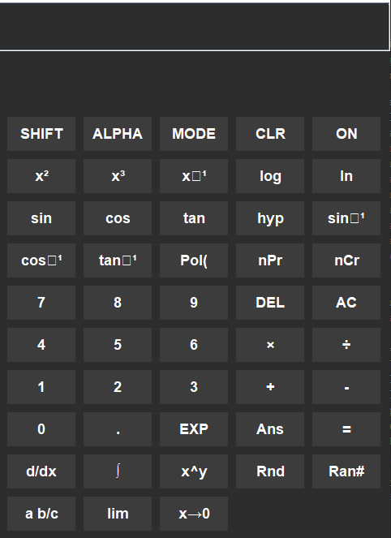

Engineering Calculator

A Calculator built using Java Swing, designed to perform basic and advanced mathematical calculations. It includes support for various functions such as exponentiation, trigonometry, logarithms, and more.

-Features-

-Basic Arithmetic: Addition, subtraction, multiplication, and division

-Scientific Functions:

-Trigonometric functions (sin, cos, tan, inverse functions)

-Logarithmic functions (log, ln)

-Exponential functions (x², x³, x⁻¹)

-Random number generation (Rnd, Ran#)

-Answer recall (Ans)

-Equation Input & Evaluation

-Keyboard & Button Click Support

-Custom UI with Dark Theme

(Optional) LaTeX Display for mathematical expressions using JLaTeXMath (requires additional setup)

*Installation*

1. Prerequisites

-Ensure you have Java (JDK 8 or later) installed.

2. Clone the Repository

git clone https://github.com/YOUR_USERNAME/EngineeringCalculator.git 
cd EngineeringCalculator

3. Compile & Run

-If you do not need LaTeX support, you can compile directly:

javac EngineeringCalculator.java 
java EngineeringCalculator

If you want LaTeX support, install JLaTeXMath:

Using Maven

Add this to pom.xml dependencies:

/<dependency>/
    /<groupId>org.scilab.forge</groupId>/ 
    /<artifactId>jlatexmath</artifactId>/ 
    /<version>1.0.7</version>/ 
/</dependency>/

Then run:

mvn clean install

Manual Setup

Download JLaTeXMath JAR

Place it in the project directory

Compile and run:

javac -cp .:jlatexmath-1.0.7.jar EngineeringCalculator.java 
java -cp .:jlatexmath-1.0.7.jar EngineeringCalculator

Usage

Click the calculator buttons or type the equation directly into the text field.

Press = to evaluate the expression.

Use AC to clear the screen or DEL to remove the last character.

Special functions such as sin, log, and x² can be used for calculations.

## Screenshots

